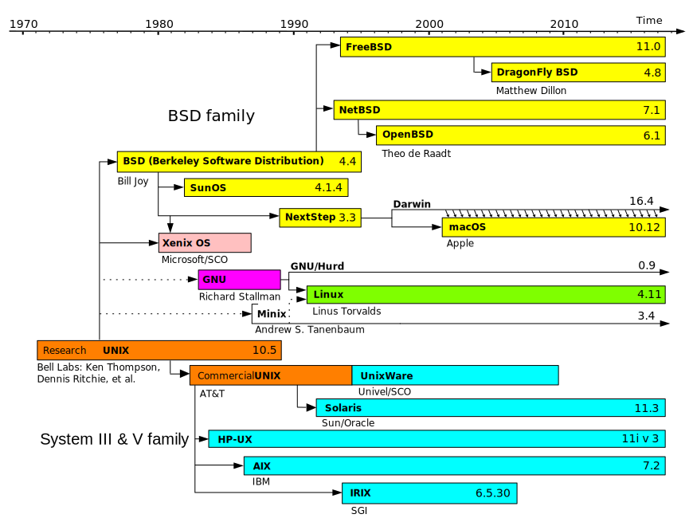
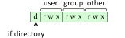

# Acknowledgements

Thanks to...

- [Karen Reid](https://www.cs.toronto.edu/~reid/) for teaching me CSC209+369.
- Andi Bergen for providing many of these slides ($\beta$).

# CSC209: What's it about?

- Interacting with a UNIX-like OS using the shell
- Systems programming with a UNIX focus: file system, process
  management, system calls, inter-process communication.
- C; but other systems languages include C++, Go and Rust.
- Programming tools for efficient coding:
  - Debugging tools: `gdb`, `valgrind`, `strace`, `ltrace`
  - Build automation: `make`
  - Version control: `git`

# CSC209: Where does it fit in? ($\beta$)

{width=60%}

# CSC209: Why Take This Course?

- Much programming touches system components!
- Shell interaction and scripting!
- Useful for many jobs in the industry!
- 80% of the internet uses UNIX-like operating systems.
- ~100% of the top 500 supercomputers run Linux.

# CSC209: Why Take This Course?

It prepares you for:

  - Compilers & Interpreters: CSC488/2107/ECE467, CSCD70
  - Computer Graphics: CSC317, 417, 419/2520
  - Computer Networks: CSC358, 457, 458/2209
  - Information Security: CSC333, 347, 423, 427/ECE568
  - Operating Systems: CSC369, 469/2208, 2227
  - Parallel Programming: CSC367/ECE1747, CSC2224/ECE1755
  - Robotics: CSC376, 476/2606, 477/2630
  - Software Engineering: CSC301, 302/D01, 309, 409

# CSC209: Prerequisites & Preparation

- Passed CSC207 or equivalent.
- Familiar with `git` in the terminal.
- Basic knowledge of a C-style language (like Java).
- A UNIX-like system, such as Linux (preferred) or MacOS.
- Know how to `ssh` into the Deerfield computer labs.
  - `ssh [UTORID]@dh20XXpcYY.utm.utoronto.ca`

# CSC209: Information & Resources

- Regularly check the course webpage and Piazza.
  - [`mcs.utm.utoronto.ca/~209/23s`](https://mcs.utm.utoronto.ca/~209/23s)
  - [`piazza.com/class/lcnmbsmgyth7fa`](https://piazza.com/class/lcnmbsmgyth7fa)
- Recommended reading:
  - King. C Programming: A Modern Approach. W. W. Norton\
    and Company, 2008.
  - Kerrisk. The Linux Programming Interface. No Starch Press, 2010
  - K. Haviland, D. Gray, and B. Salama, Unix System Programming,\
    second edition, Pearson Ed. / Addison-Wesley, 1998
- Other information:
  - [`wiki.archlinux.org/`](https://wiki.archlinux.org/)
  - [`stackoverflow.com/`](https://stackoverflow.com/)

# CSC209: Assessment Breakdown

| **Assessment**          | **Weight**         | **Due Date** |
| ----------------------- | ------------------ | ------------ |
| Labs                    | 5%                 | On-going     |
| Docs Assignment: Part 1 | 4%                 | 2023/02/09   |
| Coding Assignment 1     | 10%                | 2023/01/19   |
| Mid-Term Test           | 15%                | 2023/02/27\* |
| Coding Assignment 2     | 10%                | 2023/02/28   |
| Coding Assignment 3     | 10%                | 2023/03/12   |
| Docs Assignment: Part 2 | 1%                 | 2023/03/19   |
| Coding Assignment 4     | 10%                | 2023/04/06   |
| Final Exam              | 35% (40% autofail) | TBD          |

\* **on a Monday at 7-9pm**; let us know ASAP about conflicts to arrange make-up (written/oral) tests or weight shifting.

# CSC209: Assignment Details

- Docs: writing a `man` page for a new command (part 1) and
  revising/improving (part 2).
- Coding: submissions might be evaluated for correctness,
  memory/compute efficiency, and _elegance_.
- Submission on GitLab:
  ```sh
  git clone https://mcsscm.utm.utoronto.ca:9999/git
      /209/23s/repo_[UTORID].git
  ```
- Autotested; make sure files are correct and that everything compiles.
  - Crashes or compile errors will result in a 0.
- All individual! We have plagiarism detection tools...
- 8 grace tokens, max 4 on any assignment.
  - No late submissions afterwards...

# CSC209: Tests & Exam

## Midterm

Primary on Monday, Feb 27 at 7-9pm, outside of class time.

- Let us know ASAP about conflicts to arrange make-up (written/oral) tests or weight shifting.

Makeup on Saturday, March 4 at 11:30am, outside of class time.

- Students must be approved by their instructor.
- It'll be comprehensive and possible oral.
- Missing both the primary and makeup will result in a grade of 0 unless the reasons were valid.

## Final Exam

Closed-book, to be scheduled.

# CSC209: Teaching Staff

| **Instructor**     | **Lecture(s)** | **Office Hours**    |
| ------------------ | -------------- | ------------------- |
| Arnold Rosenbloom  | M3-5 CC1140    | W11-13 DH3088       |
|                    | T3-5 IB345     |                     |
| Bahar Aameri       | T9-11 DV2082   | T11:30-13:30 DH3019 |
| Robert (Rupert) Wu | M5-7 IB120     | M4-5 DH3021         |

# UNIX: What is it? $(\beta)$

{width=90%}

# UNIX: Philosophy $(\beta)$

Brief summary of the [UNIX philosophy](https://en.wikipedia.org/wiki/Unix_philosophy), from _A Quarter-Century of UNIX_ by P. H. Salus, 1994:

- Write programs that do one thing and do it well.
- Write programs to work together.
  - Expect that the output from your program will be used as input for another (e.g., by piping).
  - Don't require interactive input.
- Write programs that handle text streams, because that is a universal interface.

# Files: What are they?

- Files are objects that contain information.
- Everything is a file!
  - Directories are files too.
  - Hidden files a prefixed with a dot `.`, like `.gitignore` or `.ssh/`.
  - Symbolic links are references to other files.

# Files: What is a Directory? $(\beta)$

- A directory is a file that contains _directory entries_.
- Directory entries map file names to _inode_ numbers.
- An inode is a data structure of information about a file, such as its:
  - Access permissions
  - Size
  - Physical location on disk
- More about inodes in CSC369...

# Files: Directories, Paths & Hierarchy

Components of a path are joined with `/`.

## Absolute Paths

In actuality, files have absolute paths stemming from the root.

- `/usr/bin/python`
- `/home/rupert/209h5s`

## Relative Paths

- Files can mostly be used with their name:
  - `here.txt`
- More reliably with `.`:
  - `./definitely-here.txt`
- To refer up a directory, prepend `..`:
  - Sibling file: `../sibling.txt`
  - Cousin file: `../../other/cousin.txt`

# Files: Permissions ($\beta$)



- Each file has a permission string, e.g., `rw-r-xr-x`
  - First column: `d` (directory), `l` (link), or `-` (regular file)
  - `rwx` flags represent _read_, _write_, &; _execute_ permissions
  - Permissions for the owning _user_ & _group_ and _other_ users.

## Directories

`r` allows listing the directory's contents (`ls`), `w` allows creating/deleting directory's entries, `x` allows entering the directory (`cd`)

## Example

Visit this: [`www.cs.toronto.edu/~rupert/xmonad.png`](www.cs.toronto.edu/~rupert/xmonad.png)

# Files: An Analysis ($\beta$)

```python
$ ls -la
total 16
drwxr-xr-x 4 bob staff 4096 Jan  6 20:18 .
drwxr-xr-x 3 bob staff 4096 Jan  6 20:18 ..
-rw-r--r-- 1 bob staff    0 Jan  6 20:16 file1
lrwxrwxrwx 1 bob staff    5 Jan  6 20:17 file2 -> file1
-rw-r--r-- 1 bob staff    0 Jan  6 20:18 .hidden
drwxr-xr-x 2 bob staff 4096 Jan  6 20:16 test1
drwxr-xr-x 2 bob staff 8192 Jan  6 20:16 test2
$
```

- From left to right: file permissions, link count, owning user, owning group, file size, last modified date, and file name (symbolic link indicated by `->`).
- `ls -ali` shows inode numbers in the first column.

# Files: Common Commands

| command          | the gist                                   |
| ---------------- | ------------------------------------------ |
| `cd`             | changes working directory                  |
| `ls`             | lists files in a directory                 |
| `touch`          | refreshes a file                           |
| `mkdir`          | creates directories                        |
| `ln`             | creates hard or symbolic links             |
| `cp`, `mv`       | copy or move files (or directories)        |
| `chmod`, `chown` | change permissions or owner/group of files |

## Changing File Permissions

- Modify for `{u|g|o|a}{+|-}{r|w|x}`
  - `+` (add) or `-` (remove) permissions
  - `u` (owner), `g` (group), `o` (others), `a` (all)
- Set permissions in octal notation
  - add up `r` (4?), `w` (2?), and `x` (1?): `[0-7][0-7][0-7]`

# Files: Streams & Redirection $(\beta)$

- Standard I/O streams that every process starts with:
  - `stdin`: By default, reads input from keyboard
  - `stdout`: By default, writes to the console display
  - `stderr`: By default, writes to the console display
- The process treats these streams as files (surprise!)
- Use `>` to _redirect_ `stdout`, and `2>` to redirect `stderr`
  - `>` overwrites the output file, `>>` appends
  ```sh
  ls >myfiles.txt
  ```

[`linux.die.net/Intro-Linux/sect_05_01.html`](https://linux.die.net/Intro-Linux/sect_05_01.html)

# Files: Pipes & Process Substitution $(\beta)$

- _Pipes_ transfer output from one process to another
  ```sh
  ls | grep "pdf"
  ```
- _Input redirection_ transfers the contents of a file into `stdin` of a process
  ```sh
  wc <essay.txt
  ```
- _Process substitution_ creates a _temporary file_ to transfer the output from one or more processes to `stdin` of another process
  ```sh
  wc <(ls) or wc <(ls | grep "pdf")
  ```

[`http://tldp.org/LDP/abs/html/process-sub.html`](http://tldp.org/LDP/abs/html/process-sub.html)

# Scripting: Shells

An interpreter application that invokes commands and runs scripts.

- `bash` and `zsh` are commonly found in UNIX-like systems.
- They all have their own syntax and implementations.
- POSIX is a standard and we always prefer POSIX-compliant shells.
  - See more at [`itsfoss.com/posix/`](https://itsfoss.com/posix/).
- We will use `bash`.

# Scripting: Variables & `PATH`

Variables are declared with the `=` operator and referenced with `$`.

```sh
$ course=csc209
$ echo $course
csc209
```

## Special Variables

- `$?` returns the _exit code_ of the last function/command the shell ran.
- `$PATH` gives `:`-separated list of paths the shell searches for binaries in.
- `$0` is the name of the current script/function/command/application.
- `$1`, `$2`, ... are the arguments to your function/script.

# Scripting: Strings

1. Single Quote `'`:

- All special characters between these quotes lose their special meaning.

2. Double Quote `"`:

- Most special characters between these quotes lose their special meaning with these exceptions: `$`, ` \``,  `\$`, `\'`, `\"`, `\\`

3. Backslash `\`:

- Any character immediately following the backslash loses its special meaning.

4. Back quote <kbd>`</kbd>:

- Anything in between back quotes would be treated as a command and would be executed.

# Scripting: Evaluations & Conditions

`$(cmd)` aka <kbd>\`cmd\`</kbd> executes `cmd` in shell and is replaced by the result.

- `$((<expr>))` allows you to perform algebra on `<expr>`.

  [`mywiki.wooledge.org/ArithmeticExpression`](https://mywiki.wooledge.org/ArithmeticExpression)

## Conditions - `test`

- Conditions can take the form of `[ <expr> ]`.
  - `bash` is more flexible/powerful and supports two-layer brackets `[[ ]]` and/or double equals `==` that have other features.
- Alternatively, you can use `test <expr>`.
- Conditions can be negated with `!`.
- Conditions can be based on (unary) flags or (binary) comparisons.
- A disjunction ("or") of conditions can be strung with `-o` or `||`.
- Likewise, a conjunction ("and") can be strung with `-a` or `&&`.
- More about conditions next week...

[`www.geeksforgeeks.org/shell-scripting-test-command/`](https://www.geeksforgeeks.org/shell-scripting-test-command/)

# Scripting: If/Else

Shell supports `if`/`elif`/`else` and `while` like this...

```sh
if $condA; then
  echo A
elif $condB; then
  echo B
else; then
  echo neither
fi

while $condC; do
  echo C
done
```

# Scripting: For Loops

- You can iterate over a static list...
  ```sh
  for a day in Fri Thu Wed Tue Mon; do
    echo “Todays day is $day”
  done
  ```
- Or over a list stored in a variables...
  ```sh
  Month = “Jan Feb Mar Apr May Jun”
  for mon in $Month; do
    echo “Month is $mon”
  done
  ```
- Or take command-line arguments
  ```sh
  for num; do echo “Number is $num”; done
  ```

[`www.educba.com/for-loop-in-shell-scripting/`](https://www.educba.com/for-loop-in-shell-scripting/)

# Scripting: Functions

Putting the pieces together in a function...

```sh
is_div_six() {
   x=$1
   two=$((x % 2))
   if [ $((x % 3)) = 0 ] && test $two = 0; then
      echo "yes"
   elif test $((x % 3)) -eq 0; then
      echo "three"
   elif [ ! $two -eq 0 ]; then
      echo "no"
   else echo "two"; fi
}
is_div_six 12 # yes
is_div_six 64 # two
is_div_six 39 # three
```

# Scripting: Globbing $(\beta)$

- _Globbing_ patterns are strings that expand to match multiple file names
  - Similar, but simpler, than regex: see `man 7 glob`
- `?` matches any single character
- `*` matches any string, including the empty string
- `[list of characters]` matches a single character inside the list, e.g., `[abc]`
- Usage examples:
  - `rm \*.log`: Remove all files ending in `.log`
  - `ls \*.pdf`: List files ending in `.pdf`

# Commands: An Assortment

`git`, `ssh`, `scp`, `echo`, `ls`, `cd`, `cat`, `grep`, `cut`, `sed`, `which`, `more`, `rm`, `man`, `sort`, ` find`, `who`, `wc`, `tr`, `last`, `tail`, `head`, `mv`, `cmp`, `diff`, `comm`, `join`, `awk`, `rev`, `exit`, `md5sum`, `for`, `while`, `if`, `read`, `case`, `watch`, `uniq`, `gcc`, `gdb`, `od`, `rev`, `free`, `file`, `ps`, `top`, `type/command`, `curl`, `wget`, `watch`, `python`, `ltrace`, `strace`, `valgrind`, `gdbgui`, `xargs`, `stat`, `vi`

Look these up in the man pages for practice!

# Commands: `man` pages $(\beta)$

{width=275}

# Commands: `man` pages $(\beta)$

- The man pages are sectioned; you will mainly use:
  - 1: General commands
    - e.g. `man ls` to learn how to use `ls`
  - 2: System calls
  - 3: Library functions
  - 7: Miscellanea
    - e.g. `man gittutorial` or `man man-pages` <!--for an introduction to git or man pages`, `respectively-->
- If the command exists in more than one section, specify the section you want:
  - `man 1 printf` for the `printf` shell command.
  - `man 3 printf` for the `printf` library function.

# Commands: `man` pages $(\beta)$

Even the `man` command has its own man page: `man man`

{width=275}

You likely won't use any special options, aside from `man -k` or `man -K` (to search); `man man-pages` will be more generally informative.

# Commands: Compilers & Interpreters

- Shell is interpreted\*: `sh`, `bash`, `zsh`, etc.
- Python is usually interpreted\*: `python`
- Java is compiled to bytecode: `javac`
- C/C++ are compiled using `gcc`/`g++` or `clang`/`clang++`
- More about C later\...

\* interpreters typically written in C

# Shebang & Executables

To make files executable, use `chmod` to change the permissions to allow it.

- Executables can be run with filepath.
- If an executable is found in `$PATH`, it can be run just by name.

Interpreters such as shells can be specified with shebang `#!` at the top of the file. Otherwise, the inherent shell will be used.

```sh
#!/usr/bin/dash
echo this is dash
```

You can do the same with Python.

```python
#!/usr/bin/python
print("this is python")
```

# CSC209: What's next?

- Probably a lab exercise this Wednesday!
- Questions?

[`mcs.utm.utoronto.ca/~209/23s/`](https://mcs.utm.utoronto.ca/~209/23s/)
